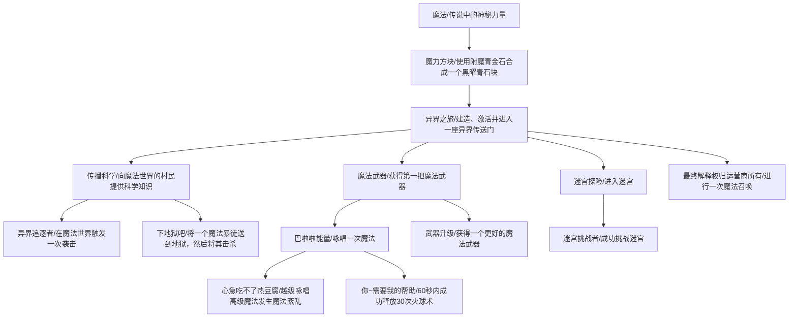

# Magicworld 设定书

- [Magicworld 设定书](#magicworld-设定书)
  - [背景设定](#背景设定)
  - [魔法世界的生态](#魔法世界的生态)
  - [特殊结构](#特殊结构)
    - [村庄](#村庄)
    - [魔力喷涌池](#魔力喷涌池)
    - [魔力怪城堡](#魔力怪城堡)
    - [废弃村庄](#废弃村庄)
    - [迷宫](#迷宫)
    - [探险者遗迹](#探险者遗迹)
  - [新物品](#新物品)
    - [附魔青金石](#附魔青金石)
  - [新方块](#新方块)
    - [黑耀青石块](#黑耀青石块)
  - [新生物](#新生物)
    - [游荡魔法使](#游荡魔法使)
  - [进度](#进度)

## 背景设定

- Minecraft 中，除了主世界（overworld）、下界（nether）和末地（the_end）外，还有一个魔法世界（magicworld）
- 附魔台是魔法世界对其他世界影响的结果，对装备附魔实际上是魔法世界给予的祝福
- 在进行附魔时，会短暂地建立与魔法世界的联系，魔法世界的游荡者可能会通过这个联系“穿越”到其他世界

## 魔法世界的生态

魔法世界有以下基本生态群系：
- 平原
- 山地
- 海洋
- 沙漠
- 雪地
- 冰原

根据魔力的不同，这些生态群系会有魔力充沛、魔力均衡、魔力枯竭不同的变种。

| 比较点 |  魔力充沛  |  魔力均衡  | 魔力枯竭 |
| :----: | :--------: | :--------: | :------: |
|  怪物  | 精英魔力怪 | 普通魔力怪 | 无魔力怪 |
|  植被  |    巨大    |    普通    |   矮小   |
|  村庄  |     无     |     有     |    无    |
|  遗迹  |     无     |     无     |    有    |

## 特殊结构

### 村庄

魔力世界的村民似乎不喜欢其他世界的人。他们不仅不会提供交易选项，还会主动攻击来自其他世界的人。

与主世界的村民不同，魔力世界的村民有着非常强大的战斗力。在夜间，他们不需要铁傀儡的保护，而且会主动攻击魔力怪物。但他们在遇到精英怪时还是会选择逃跑。

### 魔力喷涌池

由于魔力过于强盛，大自然会主动地释放魔力。魔力喷涌池会源源不断地产生魔力怪物，以缓解当地魔力过剩的局面。

### 魔力怪城堡

魔力怪城堡是魔力怪的大本营。由于魔力强大，数量庞大的他们自发地产生了社会制度，并修建了城堡。

### 废弃村庄

由于魔力枯竭，村民无法生存下去，留下的遗迹。村民在搬迁时已经带走了大多数有价值的东西，所以遗迹里通常不会找到什么东西。

### 迷宫

村民们为了娱乐活动修建的迷宫，里面布满了魔力陷阱。但如果能顺利通过，可以得到丰厚的奖励。

### 探险者遗迹

记录了不怕死的冒险者冲进魔力充沛的危险区域最后遇难的故事。

## 新物品

### 附魔青金石

**获得方式**

- 击杀游荡魔法使

**用途**

- 合成黑耀青石块

## 新方块

### 黑耀青石块

**获得方式**

- 合成

**用途**

- 建造魔法传送门

## 新生物

### 游荡魔法使

**生成**

- 主世界中使用附魔台进行附魔
- 魔法世界常规怪物

**掉落**

- 青金石
- 附魔青金石

## 进度

